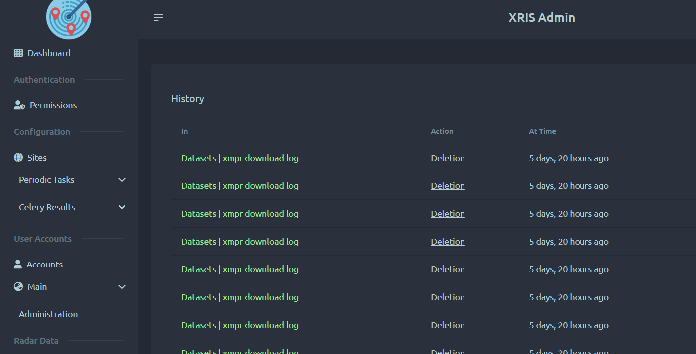
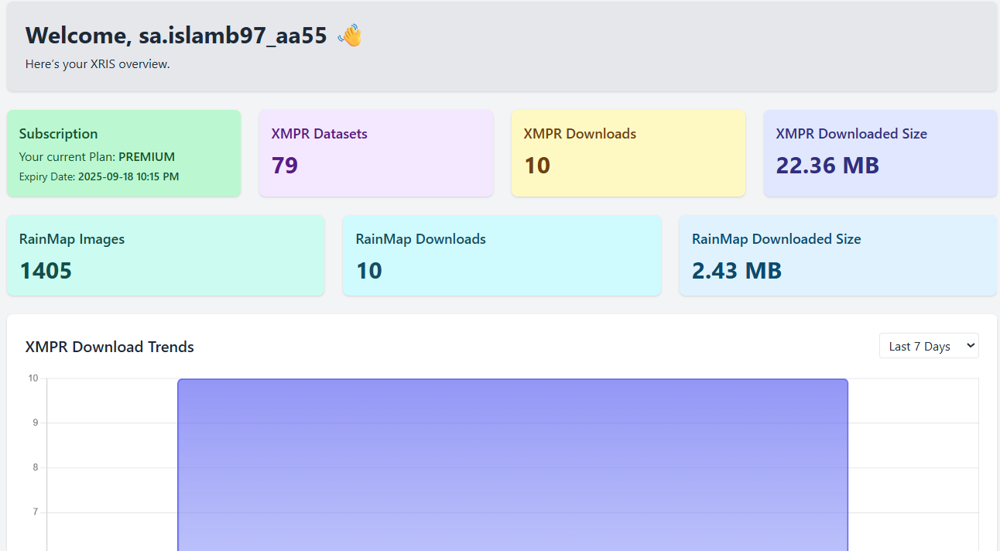

<p align="center">
  
</p>

# XRIS — X-Band Radar Information System

**XRIS** (X-Band Radar Information System) is a Django-based platform developed at MJIIT, Universiti Teknologi Malaysia. It ingests, processes, stores, and serves X-Band radar datasets (CSV, GeoTIFF, PNG, JPEG) with a focus on:

* **Data Management & Analysis**: Powerful tools for researchers and meteorologists to explore and analyze rainfall data.
* **Real-Time Live Radar Visualization**: Interactive map overlays of radar imagery.
* **User-Friendly Dashboards**: Intuitive interfaces, subscription tiers, secure authentication, and reporting.

---

## Table of Contents

1. [Key Features](#key-features)
2. [System Architecture](#system-architecture)
3. [Applications (Django Apps)](#applications-django-apps)
4. [User Interfaces](#user-interfaces)

   * [Super-Admin Panel](#super-admin-panel)
   * [User Portal](#user-portal)
5. [File & Folder Structure](#file--folder-structure)
6. [Technology Stack](#technology-stack)
7. [Local & Docker Deployment](#local--docker-deployment)
8. [Environment Variables](#environment-variables)
9. [Celery Tasks & Automation](#celery-tasks--automation)
10. [Security & Hardening](#security--hardening)
11. [Development Workflow](#development-workflow)
12. [License](#license)

---

## Key Features

| **Area**                         | **Highlights**                                                                                      |
| -------------------------------- | --------------------------------------------------------------------------------------------------- |
| 🌐 **User Portal**               | • Dashboard with statistics & mini-charts (Chart.js)                                                |
|                                  | • XMPR Data Explorer: filters, multi-select ZIP downloads, on-the-fly CSV analysis, PDF reports     |
|                                  | • RainMap Archive: JPEG gallery with pagination, download limits                                    |
| 🛠 **Super-Admin Panel**         | • DaisyUI-themed Django Admin with Heroicons                                                        |
|                                  | • Inline preview/download for CSV, PNG, TIFF, JPEG                                                  |
|                                  | • Download log inlines (user, IP, timestamp)                                                        |
|                                  | • Singleton ProjectConfig (site name, description, logo, favicon)                                   |
| 📡 **Real-Time Radar Pipeline**  | • CSV → SSV → Mesh → GeoTIFF & PNG conversion (Fortran + GDAL)                                      |
|                                  | • Automatic insertion into PostgreSQL; RainMap JPEG ingestion                                       |
|                                  | • Triggered every 2 minutes with idempotent/lock guard                                              |
| 📊 **Data Analysis & Reporting** | • In-browser rainfall matrix visualization (Alpine.js)                                              |
|                                  | • Downloadable PDF reports (html2canvas + jsPDF)                                                    |
|                                  | • Per-file statistics (min, max, mean, std, distribution)                                           |
| 🔒 **Auth & Subscriptions**      | • Django AllAuth (email/password, mandatory verification)                                           |
|                                  | • Custom User model with avatar upload                                                              |
|                                  | • Stripe subscriptions (Free & Premium), billing portal, webhook handlers                           |
| ⚙️ **GraphQL API**               | • Graphene-Django schema exposing paginated `latestXmprData` query for Live Radar viewer            |
|                                  | • Apollo-compatible endpoint                                                                        |
| 🚀 **Container-Ready**           | • Docker Compose stack: Daphne (ASGI), Celery worker & beat, Flower, PostgreSQL 17, Redis, RabbitMQ |
| 🛰 **Edge Deployment**           | • On-premise at **UTM Pagoh** server                                                                |
|                                  | • Public access via Cloudflare Tunnel (TLS, WAF)                                                    |
|                                  | • Nginx → Daphne reverse proxy, systemd services                                                    |

---

## System Architecture

```
                                  ┌───────────────┐
    ⏱ Celery Beat (every 2 min)  ──▶│ Celery Worker  │◀────────┐
       (move_… + scan_…)              └──────┬────────┘       │
                                                         📉 │
                                  ┌────────────────────┐    │
                                  │  PostgreSQL 17      │◀───┘
                                  └────────────────────┘
                                                 ▲
                                                 │ Django ORM (ASGI)
  🌐 HTTP/WebSocket Requests             ┌───────────────────┐
       ⇅ Nginx (HTTPS)                   │     Django       │
                                        │ (Daphne + Channels + AllAuth etc.) 
                                        └───────────────────┘
                                                 ▲
                                                 │ Redis (Cache + Channels)
                                          ┌───────────────┐
                                          │   Browser     │
                                          │  (User Portal)│
                                          └───────────────┘
```

* **Daphne (ASGI)** serves HTTP & WebSocket (Channels).
* **Celery Worker & Beat** handle file processing (`move_and_process_files`, `scan_and_insert_by_file_key`), scheduled every 2 minutes.
* **PostgreSQL 17** stores XMPR & RainMap records, subscriptions, user profiles, logs.
* **Redis** acts as cache (pipeline locks, sessions, CSRF) and Channels backend.
* **RabbitMQ** is the Celery broker.
* **Cloudflare Tunnel** provides TLS termination and WAF when public.

---

## Applications (Django Apps)

| **App**             | **Purpose**                                                                                               |
| ------------------- | --------------------------------------------------------------------------------------------------------- |
| **`main`**          | • Site-wide pages: Landing, Dashboard, Live Radar, Profile, Activity Logs                                 |
|                     | • Custom `SecurityMiddleware` for SQL-injection detection, IP blocking, unauthorized access logging       |
|                     | • `ProjectConfig` singleton (site name, description, logo, favicon)                                       |
| **`datasets`**      | • Models: `XmprData`, `XmprDownloadLog`                                                                   |
|                     | • XMPR Data Explorer view: filters (date, year, month), pagination, multi-select download (ZIP streaming) |
|                     | • CSV analyzer endpoint (JSON)                                                                            |
| **`processor`**     | • Models: `ProcessorXmprData`, `RainMapImage`, `RainMapDownloadLog`                                       |
|                     | • Celery tasks: `move_and_process_files`, `scan_and_insert_by_file_key`, `process_csv_file`               |
|                     | • RainMap archive UI                                                                                      |
| **`subscriptions`** | • Models: `SubscriptionPackage`, `Subscription`                                                           |
|                     | • Stripe integration: checkout, billing portal, webhook handlers                                          |
|                     | • Subscription email notifications                                                                        |
| **`heroicons`**     | • Provides Heroicons template tags for UI icons                                                           |

> **Note:** The GraphQL schema is defined in `xris/schema.py` (combining queries from `datasets.schema.Query`).

---

## User Interfaces

### Super-Admin Panel

* **Theme**: DaisyUI + Heroicons, dark-mode friendly.
* **Highlights**:

  * Inline preview/download buttons for CSV, PNG, GeoTIFF, JPEG.
  * Inlines showing download logs (user, IP, timestamp) for each `XmprData` & `RainMapImage`.
  * **ProjectConfig** singleton enforcing a single instance (site name, description, logo, favicon).
  * Audit trail: show Django `LogEntry` inline in User detail (with permissions).

<div align="center">
  
</div>

---

### User Portal

1. **Landing Page**

   * Hero section with title, subtitle, and “Get Started Free” / “View Live Radar” buttons.
   * About XMPR section explaining X-Band Multiparameter Radar.
   * Image gallery carousel showcasing recent radar observations.

2. **Dashboard (`/home`)**

   * Stat cards for subscription status, XMPR counts, download counts, total download size, RainMap counts, and recent activities.
   * Chart.js bar charts showing download trends (last 7 days vs. 30 days).
   * Lists for recent uploads/downloads (XMPR & RainMap).

3. **XMPR Data Explorer (`/datasets/xmpr_data`)**

   * Filterable & paginated table (Timestamp, CSV/PNG preview/TIFF, Size).
   * Multi-select checkboxes: compute selected count & total size.
   * **Download Selected (ZIP)** & **Analyze Selected (JSON → PDF report)**.
   * Alpine.js component for selection state, size formatting, limit checks.

4. **RainMap Archive (`/processor/rainmap_data`)**

   * Similar UX to XMPR Explorer: table of RainMap JPEGs with timestamp, preview, size.
   * Multi-select & ZIP download (Premium users only).

5. **Live Radar Map (`/main/live_radar`)**

   * MapLibre GL JS map centered on UTM Pagoh coordinates.
   * Alpine.js + GraphQL: fetches paginated radar frames (`id`, `time`, `png` URL).
   * Carousel of radar frames (10 per page) below map; clicking a card toggles raster overlay.
   * Smooth map panning & zoom, fit to bounding box, responsive design.

6. **Subscription Page (`/subscriptions/`)**

   * Lists available packages (Free, Premium) with pricing & duration.
   * Stripe Checkout integration: create Checkout Session & redirect.
   * Billing Portal button (Stripe portal) to manage payment method & cancel subscription.
   * Webhooks: handle `checkout.session.completed`, `invoice.paid`, `customer.subscription.updated`, `invoice.payment_failed`, `customer.subscription.deleted`.

7. **Profile & Activity**

   * Profile form: update first/last name, avatar upload (live filename preview).
   * Activity Logs: paginated Django `LogEntry` for current user (date in naturaltime, action, object, content type).

<div align="center">
  
</div>

---

## File & Folder Structure

```
xris-app/                         # Project root
├── assets/                       # Uncollected custom assets (SCSS, raw icons)
├── datasets/                     # XMPR-related models, views, admin, templates, GraphQL schema
├── docker/                       # Docker configuration
│   ├── Dockerfile                # Production multi-stage build
│   └── docker-compose.yml        # Services: web, db, redis, rabbitmq, flower
├── main/                         # Core pages, middleware, forms, models, templates
├── polar2mesh/                   # Native Fortran binary + LUTs for polar2mesh conversion
├── processor/                    # Processing pipeline, Celery tasks, utils, RainMap models, views, admin
├── requirements.txt              # Python dependencies
├── RadarPagoh/                   # Uploaded & processed files
│   ├── converted/                # CSV → SSV → Mesh → GeoTIFF/PNG outputs
│   ├── csv/                      # Raw CSV uploads
│   ├── images/                   # Processed images (PNG, TIFF)
│   │   ├── png/
│   │   └── tif/
│   ├── rainmaps/                 # RainMap JPEGs
│   └── temp/                     # Temporary working dir for Celery tasks
├── subscriptions/                # Subscription models, Stripe integration, webhook handlers, admin
├── static/                       # Collected static files (CSS, JS, images, Heroicons)
├── templates/                    # Global templates (base.html, includes, partials)
├── xris/                         # Django project directory
│   ├── __init__.py
│   ├── asgi.py                   # ASGI application (Daphne + Channels)
│   ├── settings.py               # Settings: environment, Redis, Channels, Celery, Stripe, etc.
│   ├── schema.py                 # Graphene GraphQL schema (latestXmprData)
│   ├── urls.py                   # URL routes, static/media serving
│   └── wsgi.py                   # WSGI entry point (if needed)
├── manage.py                     # Django management script
├── README.md                     # This file
└── .env.sample                   # Sample environment variables
```

---

## Technology Stack

### Backend

* **Django 5.2 (ASGI)** with **Daphne** and **Channels** for WebSocket support
* **Graphene-Django** for GraphQL API
* **PostgreSQL 17** as the relational database
* **Redis 7** for caching, session storage, and Channels layer
* **RabbitMQ 3** as the Celery broker

### Frontend

* **Tailwind CSS** for utility-first styling
* **Alpine.js (v3)** for lightweight component interactivity
* **MapLibre GL JS** for vector map & raster overlays (Live Radar)
* **Chart.js** for bar charts (download trends)
* **html2canvas** + **jsPDF** for PDF report generation

### Task Queue

* **Celery 5** (worker + beat) for background tasks
* **Flower** for real-time task monitoring (port 5555)

### Authentication & Billing

* **Django AllAuth** for email/password login & signup (mandatory email verification)
* **Custom User** model (email as `USERNAME_FIELD`, avatar upload)
* **Stripe Subscriptions API** (Free & Premium tiers) with webhook handlers

### Security & Performance

* Custom **SecurityMiddleware** to detect SQL-injection patterns, track & block IPs
* CSRF Trusted Origins derived from `HOST_URL`
* Strict HTTP security headers (HSTS, X-Frame-Options, X-Content-Type-Options) enforced via Nginx & Django
* Redis-backed caching for pipeline lock (2 min), session caching, and query caching
* File size & count limits (100 files / 500 MB total for downloads, 100 MB uploads)

### Containerization & CI/CD

* **Docker Compose** for local & production stacks (web, db, redis, rabbitmq, flower)
* **GitHub Actions** (sample workflow): linting (pre-commit), tests (pytest), build/push images

---

## Local & Docker Deployment

### Quick Start (Docker)

1. **Clone the repository**

   ```bash
   git clone git@github.com:saislamb97/xris-app.git
   cd xris-app
   ```

2. **Copy `.env.sample` → `.env`**

   ```bash
   cp .env.sample .env
   ```

   • Set `DJANGO_SECRET_KEY`, database credentials, Redis, Stripe keys, and `HOST_URL`.

3. **Build & start services**

   ```bash
   docker compose up --build -d
   ```

4. **Create superuser (first time only)**

   ```bash
   docker compose exec web python manage.py createsuperuser
   ```

5. **Access the services**

   * **Web (Daphne)**: `http://localhost:8000`
   * **Flower (Celery monitor)**: `http://localhost:5555`

#### Docker Compose Services

| Service      | Port(s)      | Description                                       |
| ------------ | ------------ | ------------------------------------------------- |
| **web**      | 8000         | Daphne ASGI server (Nginx ↔ Daphne reverse proxy) |
| **db**       | 5435         | PostgreSQL (persistent volume: `pgdata`)          |
| **redis**    | 6379         | Cache & Channels layer                            |
| **rabbitmq** | 5672 / 15672 | Celery broker + management UI                     |
| **flower**   | 5555         | Celery task monitoring                            |

---

### Bare-Metal Deployment (UTM Pagoh)

1. **Systemd Units**

   * `web.service` → Daphne (or Daphne + Gunicorn)
   * `celery.service`
   * `celerybeat.service`
   * `cloudflared.service` (Cloudflare Tunnel)

2. **Nginx**

   * Reverse proxy HTTP & HTTPS traffic to `http://127.0.0.1:8000` (Daphne).
   * Enforce HSTS, X-Frame-Options, X-Content-Type-Options, Content-Security-Policy.

3. **Cloudflare Tunnel**

   * Run `cloudflared tunnel --url http://localhost:8000` as a systemd service.
   * Provides TLS termination, WAF, optional access control.

4. **Logrotate**

   * Rotate Django logs (e.g., `/var/log/xris/*.log`) daily or weekly.

5. **PostgreSQL**

   * Install PostgreSQL v17; configure user/database per `.env` values.
   * Use port `5435` (or standard `5432`).

6. **Redis**

   * Bind to `localhost` (no external exposure) for cache & Channels.

7. **RabbitMQ**

   * Secure user credentials and vhost configuration.

8. **File Permissions**

   * Ensure `media/` and `static/` directories are writable by the Django process.

---

## Environment Variables

Copy `.env.sample` to `.env` and update values accordingly. Below is a summary:

```dotenv
# Debug
DEBUG=True

# Django
DJANGO_SECRET_KEY="django-insecure-<your-secret-key>"

# Host
HOST_URL="http://127.0.0.1:8000"

# Database
DATABASE_NAME=xris
DATABASE_USER=postgres
DATABASE_PASSWORD=postgres
DATABASE_HOST=127.0.0.1
DATABASE_PORT=5432

# Redis
REDIS_HOST=localhost
REDIS_PORT=6379
REDIS_DB=0

# RabbitMQ
RABBITMQ_DEFAULT_USER=guest
RABBITMQ_DEFAULT_PASS=guest

# Stripe
STRIPE_PUBLISHABLE_KEY="pk_test_xxx"
STRIPE_SECRET_KEY="sk_test_xxx"
STRIPE_WEBHOOK_SECRET="whsec_xxx"

# Email (Gmail SMTP)
EMAIL_HOST_USER=your-email@gmail.com
EMAIL_HOST_PASSWORD=your-email-password
EMAIL_FROM=your-email@gmail.com

# File System
MEDIA_ROOT=/RadarPagoh
POLAR2MESH_PATH=/xris/polar2mesh/polar2mesh
TARGET_DIRS=converted,images/png,images/tif,RainMAP_JPEG
```

> **Note:** Never commit your real secrets to version control.

---

## Celery Tasks & Automation

| **Task**                                  | **Trigger / Schedule**                            | **Functionality**                                                                         |
| ----------------------------------------- | ------------------------------------------------- | ----------------------------------------------------------------------------------------- |
| **`move_and_process_files`**              | Scheduled every 2 minutes (Celery Beat)           | • Move raw CSVs → convert to SSV → run `polar2mesh` → produce mesh → GDAL → GeoTIFF → PNG |
|                                           |                                                   | • Store outputs under `converted/`, log successes/failures                                |
| **`scan_and_insert_by_file_key`**         | Chained after `move_and_process_files`            | • Scan processed files by date folder                                                     |
|                                           |                                                   | • Insert missing `DatasetXmprData` & `ProcessorXmprData` records                          |
|                                           |                                                   | • Ingest new RainMap JPEGs into `RainMapImage`                                            |
| **`process_csv_file(csv_relative_path)`** | Invoked internally by `move_and_process_files`    | • Skip CSVs with <10 data rows                                                            |
|                                           |                                                   | • Convert CSV → SSV (TranslateFormat)                                                     |
|                                           |                                                   | • Run `polar2mesh` binary → mesh file                                                     |
|                                           |                                                   | • GDAL: mesh → GeoTIFF                                                                    |
|                                           |                                                   | • NumPy + ascii2img: mesh → color PNG                                                     |
|                                           |                                                   | • Insert into `ProcessorXmprData` if new                                                  |
|                                           |                                                   | • Cleanup temp files                                                                      |
| **`trigger_xmpr_pipeline(force=False)`**  | Called in `/main/live_radar` & `/main/home` views | • Uses cache key `last_xmpr_pipeline_run` (TTL 120 s) to rate-limit                       |
|                                           |                                                   | • Acquires lock `xmpr_pipeline_lock` (TTL 120 s) to prevent overlapping runs              |
|                                           |                                                   | • Dispatches chained tasks (`move_and_process_files` → `scan_and_insert_by_file_key`)     |
| **`trigger_subscription_update`**         | Called in Dashboard view on every page load       | • Checks Stripe subscription statuses (via webhook updates)                               |
|                                           |                                                   | • Updates expiration/status, sends notification emails                                    |

* **Flower**: Access monitoring UI at `http://<host>:5555`.

---

## Security & Hardening

### 1. Custom SecurityMiddleware

* **SQL-Injection Detection**: Scans request paths for SQL keywords (`SELECT`, `DROP`, `OR`, `AND`, comments, etc.).
* **IP Blocking**: Tracks suspicious attempts per IP (rolling 1 hour window) and blocks offenders for up to 72 hours.
* **Unauthorized Logging**: Emits `unauthorized_access` signal to log details (IP, reverse DNS, location via `ipinfo.io`, user agent, URL, reason).
* **Error Handling**: Redirects `403/404` responses (if not on home page) back to home to avoid infinite loops, logs the event.

### 2. HTTP Security Headers (via Nginx & Django)

* **HSTS**: `Strict-Transport-Security: max-age=63072000; includeSubDomains; preload`
* **X-Frame-Options**: `DENY`
* **X-Content-Type-Options**: `nosniff`
* **Content-Security-Policy**: Configure in Nginx (recommended to whitelist only necessary sources).

### 3. CSRF & CORS

* `CSRF_TRUSTED_ORIGINS` derived from `HOST_URL`.
* `CorsMiddleware` allows only needed HTTP methods & headers.

### 4. Authentication & Access Control

* **Premium-Only Downloads**: All XMPR & RainMap downloads require an active Premium subscription.
* **Email Verification**: Enforced by AllAuth (`ACCOUNT_EMAIL_VERIFICATION = "mandatory"`).
* **Pipeline Rate-Limit**: The `trigger_xmpr_pipeline` method uses cache TTL (120 s) to prevent re-runs.

### 5. Upload Limits & Validation

* **File Upload Limits**: `DATA_UPLOAD_MAX_MEMORY_SIZE = 100 MB`, `FILE_UPLOAD_MAX_MEMORY_SIZE = 100 MB` (in settings).
* **Form Field Limit**: `DATA_UPLOAD_MAX_NUMBER_FIELDS = 10 000`.
* **Download Limits**: Max 100 files or 500 MB per request.

### 6. Cloudflare Tunnel (Production)

* **TLS Termination**: Cloudflare manages SSL certificates, forwards HTTP traffic to local Django (port 8000).
* **WAF & Rate-Limiting**: Optional rules to protect endpoints (Stripe webhooks, login, etc.).

---

## Development Workflow

```bash
# Clone & Activate Virtual Env
git clone git@github.com:saislamb97/xris-app.git
cd xris-app
python3 -m venv venv
source venv/bin/activate  # On Windows: `venv\Scripts\activate`

# Install Dependencies
pip install -r requirements.txt

# Copy & Edit Environment Variables
cp .env.sample .env
# Edit .env: set DJANGO_SECRET_KEY, DATABASE_*, REDIS_*, STRIPE_*, EMAIL_*, etc.

# Apply Migrations & Create Superuser
python manage.py migrate
python manage.py createsuperuser

# Run Development Server (Daphne + Channels)
python manage.py runserver 0.0.0.0:8000

# In separate terminal sessions (or via Docker Compose), start Celery:
# Celery Worker
celery -A xris worker --loglevel=info
# Celery Beat
celery -A xris beat --scheduler django --loglevel=info
# Flower (Celery monitor): 
celery -A xris flower --port=5555 --address=0.0.0.0

# Linting & Formatting (if pre-commit is set up)
pre-commit run --all-files

# Run Tests
pytest -q
```

* **Hot-Reload**: Optionally install `django-extensions` and use `runserver_plus` for auto-reload.
* **GraphQL Playground**: Navigate to `http://localhost:8000/graphql` (GET request opens GraphiQL).

---

## License

This project is © 2025 **XRIS / UTM Pagoh** and released under the [UTM License](LICENSE).

<p align="center">
  <em>Built with ♥ for researchers and engineers at UTM Pagoh</em>
</p>
