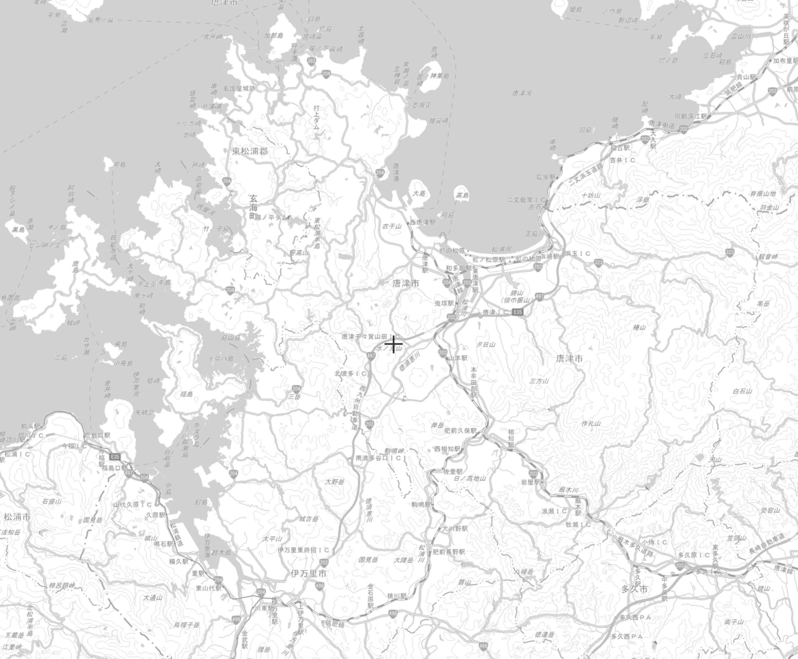

---

# 📡 XRIS — X-Band Radar Information System


XRIS (**X-Band Radar Information System**) is a powerful Django-based platform built to manage, analyze, and visualize radar datasets like CSV, TIFF, and PNG files, especially for researchers and meteorologists at **UTM**.

---

## 🚀 Features

- **📥 Easy Upload**: Upload and manage radar datasets securely.
- **📊 Data Visualization**: Explore radar data trends, images, and rainfall patterns.
- **📍 Live Radar Map**: View real-time radar overlays using MapLibre + Alpine.js.
- **📈 Smart Analysis**: Browse datasets by date, year, month, and size.
- **🔒 Secure Authentication**: Email verification, login/signup with Django AllAuth.
- **💎 Subscriptions**: Free and Premium access with Stripe integration.
- **🧹 Beautiful Admin**: Custom admin dashboard using DaisyUI and Heroicons.
- **⚡ Blazing Fast**: Optimized with Redis caching, streaming downloads, and large file support.

---

## 📂 Project Structure

```bash
XRIS/
├── assets/             # Custom static assets (optional)
├── datasets/           # Radar datasets app
│   ├── models.py       # XmprData, XmprDownloadLog
│   ├── views.py
├── main/               # Core system (landing, radar viewer, dashboard)
│   ├── models.py       # Custom User Model
│   ├── views.py
│   ├── templates/
├── subscriptions/      # Subscription plans and user subscription logic
│   ├── models.py
├── templates/          # Global templates
│   ├── base.html       # Base template with Tailwind CSS
│   ├── landing.html    # Public landing page
│   ├── live_radar.html # Live radar map viewer
│   ├── xmpr_data.html  # Dataset explorer
│   ├── activity.html   # Activity logs page
├── static/             # Static files
│   ├── img/            # Images like logo, legend
│   ├── css/
│   ├── js/
├── media/              # Uploaded media files (managed via Django)
├── xris/               # Main Django project settings
│   ├── settings.py     # Full secured settings with Redis, Channels, Stripe
│   ├── urls.py
│   ├── schema.py       # GraphQL API for latest radar data
├── manage.py           # Django management script
└── README.md           # (This file)
```

---

## ⚙️ Technology Stack

| Layer         | Technology                               |
|:--------------|:-----------------------------------------|
| Backend       | Django 5.2, GraphQL (Graphene-Django)     |
| Frontend      | Tailwind CSS, Alpine.js, MapLibre GL      |
| Database      | PostgreSQL                               |
| Caching       | Redis                                     |
| Authentication| Django AllAuth + Custom User Model       |
| Cloud Storage | AWS S3 (optional) / Local Storage         |
| Payments      | Stripe (for subscriptions)               |
| Admin Panel   | DaisyUI + Heroicons on Django Admin       |

---

## 🗺️ Live Radar Map (Alpine.js + MapLibre)

- Displays latest radar frames in a beautiful carousel.
- Smooth panning, zoom, and switching between frames.
- Responsive and mobile-friendly!



---

## 🛡️ Security and Production Readiness

- HTTPS, HSTS, CSRF protections.
- Secure user login with email verification.
- Redis-backed sessions and caching.
- Upload limits (Max 100MB upload).
- Rate limits can be added easily.

---

## 📦 Setup Instructions

```bash
# Clone the repo
git clone https://github.com/saislamb97/xris.git
cd xris

# Create virtual environment
python -m venv venv
source venv/bin/activate  # or venv\Scripts\activate on Windows

# Install dependencies
pip install -r requirements.txt

# Set up environment variables (.env)
cp .env.example .env

# Run migrations
python manage.py migrate

# Create superuser
python manage.py createsuperuser

# Start the server
python manage.py runserver
```

---

## 🛠️ Environment Variables (.env example)

```env
DJANGO_SECRET_KEY=your-django-secret-key
DJANGO_DATABASE_NAME=xris
DJANGO_DATABASE_USER=postgres
DJANGO_DATABASE_PASSWORD=postgres
DJANGO_DATABASE_HOST=127.0.0.1
DJANGO_DATABASE_PORT=5432

REDIS_HOST=localhost
REDIS_PORT=6379
REDIS_DB=0

EMAIL_HOST_USER=your-email@example.com
EMAIL_HOST_PASSWORD=your-email-password
EMAIL_FROM=your-email@example.com

HOST_URL=http://localhost:8000
STRIPE_SECRET_KEY=your-stripe-secret-key
STRIPE_WEBHOOK_SECRET=your-stripe-webhook-secret
S3_BUCKET=your-bucket-name
AWS_ACCESS_KEY_ID=your-aws-key
AWS_SECRET_ACCESS_KEY=your-aws-secret
REGION=your-aws-region
```

---

## 🎯 Roadmap

- [x] Dataset Explorer with Pagination and Filters
- [x] Live Radar Viewer with smooth navigation
- [x] Download multiple datasets in zipstream
- [x] Premium Subscriptions (Stripe)
- [x] GraphQL API for real-time radar frames
- [ ] Admin CMS improvements (more stats, logs)
- [ ] User-friendly email templates
- [ ] AI analysis for rainfall patterns (future 🚀)

---

## 🤝 Contributions

> Contributions are welcome! Please fork the project and submit a pull request. 🚀

---

# 🌟 Built with love for researchers and engineers at **UTM.**

---